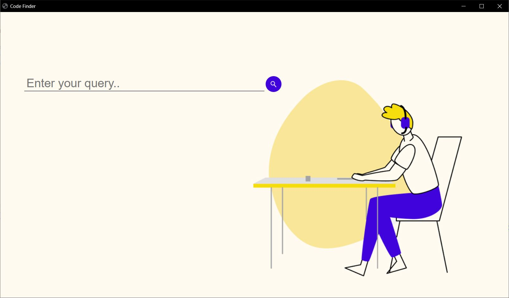

- This project help user to find code of any topic of any programming language.
- It's GUI based app with easy to use interface.
  
<b>Dependency Used:</b>
- eel : for making simple HTML/JS GUI apps
- howdoi : for answering basic programming questions

<b>Screen 1:</b>

<b>Screen 2:</b>

